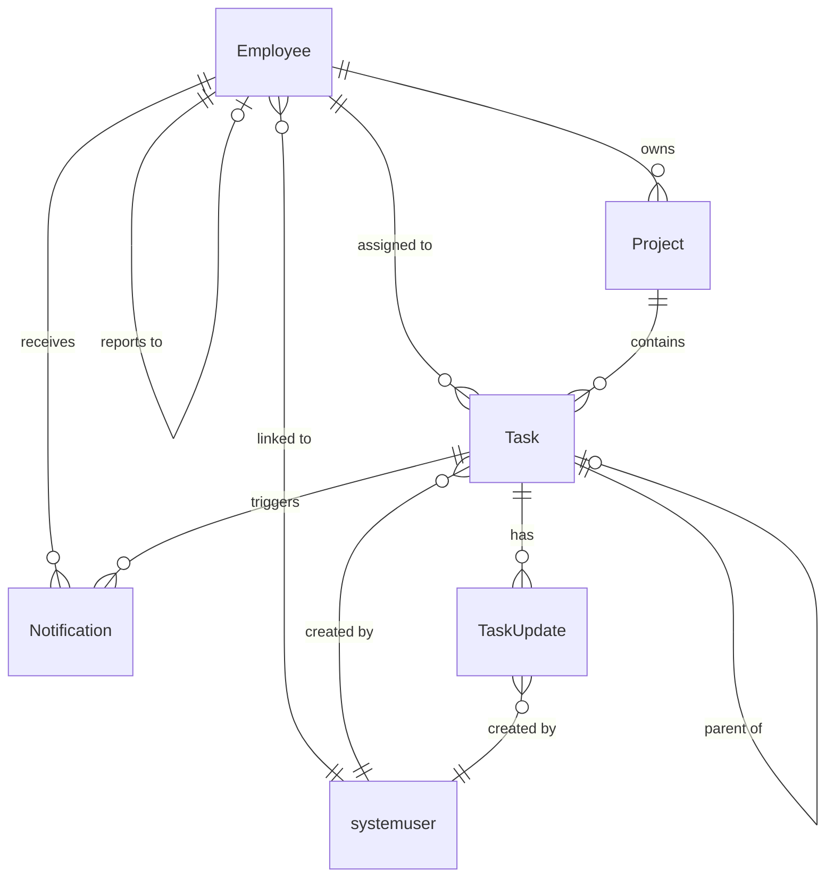

# Dataverse Table Definitions

> **Notes:**
> - Standard tables: use when functionality already exists (e.g., `systemuser`, `account`).
> - Enable Change Tracking on tables that will be synchronized.
> - Add Alternate Key(s) where Upsert is needed.
> - Index frequently queried columns.

---

## Relationships Overview

```
┌──────────────┐       ┌──────────────┐       ┌──────────────┐
│   Employee   │ 1───N │    Task      │ 1───N │  TaskUpdate  │
└──────────────┘       └──────────────┘       └──────────────┘
       │ 1                    │ N
       │                      │
       │ N                    │ 1
┌──────────────┐       ┌──────────────┐
│   Project    │ 1───N │    Task      │
└──────────────┘       └──────────────┘
       │
       │ 1
       ▼ N
┌──────────────┐
│  Employee    │ (Owner)
└──────────────┘

┌──────────────┐       ┌──────────────┐
│   Employee   │ 1───N │ Notification │
└──────────────┘       └──────────────┘
       │
       │ self-referential (Manager)
       ▼
┌──────────────┐
│   Employee   │
└──────────────┘
```

---

## Employee

| Property | Value |
|----------|-------|
| **Table Type** | Standard (custom) |
| **Primary Key** | employeeid (GUID) |
| **Primary Name** | FullName (Text, 200) |
| **Plural Name** | Employees |
| **Change Tracking** | Enabled |

### Fields

| Display Name | Schema Name | Type | Required | Notes |
|--------------|-------------|------|----------|-------|
| Employee Number | cr_employeenumber | Text (20) | ✓ | Alternate Key |
| First Name | cr_firstname | Text (100) | ✓ | |
| Last Name | cr_lastname | Text (100) | ✓ | |
| Full Name | cr_fullname | Text (200) | ✓ | Calculated: FirstName + LastName |
| Email | cr_email | Email | | |
| Phone | cr_phone | Phone | | |
| Title | cr_title | Text (100) | | Job title |
| Manager | cr_managerid | Lookup → Employee | | Self-referential |
| System User | cr_systemuserid | Lookup → systemuser | | Link to Entra/AD user |
| Department | cr_department | Text (100) | | |
| Hire Date | cr_hiredate | Date Only | | |
| Is Active | cr_isactive | Boolean | | Default: Yes |

### Relationships

| Relationship | Type | Related Table | Cascade |
|--------------|------|---------------|---------|
| Employee_Manager | N:1 | Employee (self) | Referential (RemoveLink) |
| Employee_SystemUser | N:1 | systemuser | Referential |
| Employee_Tasks | 1:N | Task | Referential |
| Employee_OwnedProjects | 1:N | Project | Referential |
| Employee_Notifications | 1:N | Notification | Cascade Delete |
| Employee_DirectReports | 1:N | Employee | Referential |

### Behaviors

- **Alternate Key:** EmployeeNumber
- **Indexes:** EmployeeNumber, Email, ManagerId, IsActive
- **Business Rule:** FullName = FirstName + " " + LastName
- **Security:** Manager role: read/write for direct reports; Employee role: read own

---

## Project

| Property | Value |
|----------|-------|
| **Table Type** | Standard (custom) |
| **Primary Key** | projectid (GUID) |
| **Primary Name** | ProjectName (Text, 200) |
| **Plural Name** | Projects |
| **Change Tracking** | Enabled |

### Fields

| Display Name | Schema Name | Type | Required | Notes |
|--------------|-------------|------|----------|-------|
| Project Name | cr_projectname | Text (200) | ✓ | Primary name |
| Project Code | cr_projectcode | Text (20) | ✓ | Alternate Key |
| Description | cr_description | Multiline (2000) | | |
| Start Date | cr_startdate | Date Only | | |
| End Date | cr_enddate | Date Only | | |
| Status | cr_status | Choice | ✓ | See choices below |
| Owner | cr_ownerid | Lookup → Employee | ✓ | Project manager |
| Budget | cr_budget | Currency | | |
| Priority | cr_priority | Choice | | High, Medium, Low |
| Completion % | cr_completionpercent | Whole Number | | 0-100, calculated or manual |

### Status Choices

| Value | Label |
|-------|-------|
| 1 | Planned |
| 2 | Active |
| 3 | On Hold |
| 4 | Completed |
| 5 | Cancelled |

### Relationships

| Relationship | Type | Related Table | Cascade |
|--------------|------|---------------|---------|
| Project_Owner | N:1 | Employee | Referential |
| Project_Tasks | 1:N | Task | Cascade Delete (or Restrict) |

### Behaviors

- **Alternate Key:** ProjectCode
- **Indexes:** ProjectCode, OwnerId, Status, StartDate
- **Validation:** EndDate >= StartDate

---

## Task

| Property | Value |
|----------|-------|
| **Table Type** | Standard (custom) |
| **Primary Key** | taskid (GUID) |
| **Primary Name** | Title (Text, 200) |
| **Plural Name** | Tasks |
| **Change Tracking** | Enabled |

### Fields

| Display Name | Schema Name | Type | Required | Notes |
|--------------|-------------|------|----------|-------|
| Title | cr_title | Text (200) | ✓ | Primary name |
| Task Number | cr_tasknumber | Text (20) | ✓ | Alternate Key, auto-number recommended |
| Description | cr_description | Multiline (4000) | | |
| Priority | cr_priority | Choice | | See choices below |
| Status | cr_status | Choice | ✓ | See choices below |
| Project | cr_projectid | Lookup → Project | | |
| Assigned To | cr_assignedtoid | Lookup → Employee | | |
| Created By | cr_createdbyid | Lookup → systemuser | | Auto-populated |
| Due Date | cr_duedate | DateTime | | Date and Time |
| Start Date | cr_startdate | DateTime | | |
| Completed Date | cr_completeddate | DateTime | | |
| Estimated Hours | cr_estimatedhours | Decimal (2) | | |
| Actual Hours | cr_actualhours | Decimal (2) | | Rollup from TaskUpdate |
| External Id | cr_externalid | Text (100) | | For external system mapping |
| Tags | cr_tags | Text (500) | | Comma-separated or use N:N |

### Priority Choices

| Value | Label |
|-------|-------|
| 1 | Critical |
| 2 | High |
| 3 | Medium |
| 4 | Low |

### Status Choices

| Value | Label |
|-------|-------|
| 1 | New |
| 2 | Assigned |
| 3 | In Progress |
| 4 | On Hold |
| 5 | Completed |
| 6 | Cancelled |

### Relationships

| Relationship | Type | Related Table | Cascade |
|--------------|------|---------------|---------|
| Task_Project | N:1 | Project | Referential |
| Task_AssignedTo | N:1 | Employee | Referential |
| Task_CreatedBy | N:1 | systemuser | Referential |
| Task_Updates | 1:N | TaskUpdate | Cascade Delete |
| Task_Notifications | 1:N | Notification | Cascade Delete |
| Task_ParentTask | N:1 | Task (self) | Referential |
| Task_Subtasks | 1:N | Task (self) | Referential |

### Behaviors

- **Alternate Key:** TaskNumber
- **Indexes:** TaskNumber, AssignedToId, Status, DueDate, ProjectId, ExternalId
- **Rollup Field:** ActualHours from TaskUpdate (where UpdateType = TimeEntry)
- **Auto-Number:** Consider for TaskNumber (e.g., TASK-{SEQNUM:5})

---

## TaskUpdate

| Property | Value |
|----------|-------|
| **Table Type** | Standard (custom) or Activity |
| **Primary Key** | taskupdateid (GUID) |
| **Primary Name** | Title (Text, 200) |
| **Plural Name** | Task Updates |
| **Change Tracking** | Disabled (append-only) |

### Fields

| Display Name | Schema Name | Type | Required | Notes |
|--------------|-------------|------|----------|-------|
| Title | cr_title | Text (200) | ✓ | Auto-generated summary |
| Task | cr_taskid | Lookup → Task | ✓ | Parent task |
| Update Text | cr_updatetext | Multiline (4000) | | |
| Update Type | cr_updatetype | Choice | ✓ | See choices below |
| Hours Logged | cr_hourslogged | Decimal (2) | | For TimeEntry type |
| Previous Status | cr_previousstatus | Choice | | For StatusChange type |
| New Status | cr_newstatus | Choice | | For StatusChange type |
| Created By | cr_createdbyid | Lookup → systemuser | | Auto-populated |
| Created On | cr_createdon | DateTime | | Auto-populated |
| Sentiment Score | cr_sentimentscore | Decimal (4) | | -1.0 to 1.0, AI Builder |
| Attachments | cr_attachments | File | | Optional file upload |

### Update Type Choices

| Value | Label |
|-------|-------|
| 1 | Note |
| 2 | Status Change |
| 3 | Time Entry |
| 4 | Assignment Change |
| 5 | Attachment Added |

### Relationships

| Relationship | Type | Related Table | Cascade |
|--------------|------|---------------|---------|
| TaskUpdate_Task | N:1 | Task | Cascade (delete with parent) |
| TaskUpdate_CreatedBy | N:1 | systemuser | Referential |

### Behaviors

- **Append-only:** No update/delete via UI (enforce via security role)
- **Audit Pattern:** Consider elastic table for high volume
- **Retention:** Apply data retention policy (e.g., 2 years)

---

## Notification

| Property | Value |
|----------|-------|
| **Table Type** | Standard (custom) |
| **Primary Key** | notificationid (GUID) |
| **Primary Name** | Subject (Text, 200) |
| **Plural Name** | Notifications |
| **Change Tracking** | Disabled |

### Fields

| Display Name | Schema Name | Type | Required | Notes |
|--------------|-------------|------|----------|-------|
| Subject | cr_subject | Text (200) | ✓ | Primary name |
| Recipient | cr_recipientid | Lookup → Employee | ✓ | |
| Channel | cr_channel | Choice | ✓ | See choices below |
| Message | cr_message | Multiline (4000) | | |
| Related Task | cr_relatedtaskid | Lookup → Task | | |
| Related Project | cr_relatedprojectid | Lookup → Project | | |
| Is Read | cr_isread | Boolean | | Default: No |
| Sent On | cr_senton | DateTime | | |
| Read On | cr_readon | DateTime | | |
| Notification Type | cr_notificationtype | Choice | | TaskAssigned, DueReminder, etc. |
| Retry Count | cr_retrycount | Whole Number | | For failed delivery |

### Channel Choices

| Value | Label |
|-------|-------|
| 1 | Email |
| 2 | Microsoft Teams |
| 3 | Push Notification |
| 4 | In-App |

### Notification Type Choices

| Value | Label |
|-------|-------|
| 1 | Task Assigned |
| 2 | Task Updated |
| 3 | Due Date Reminder |
| 4 | Project Status Change |
| 5 | Mention |

### Relationships

| Relationship | Type | Related Table | Cascade |
|--------------|------|---------------|---------|
| Notification_Recipient | N:1 | Employee | Cascade Delete |
| Notification_Task | N:1 | Task | Cascade Delete |
| Notification_Project | N:1 | Project | Referential |

### Behaviors

- **Transient Data:** Apply retention policy (e.g., 90 days)
- **Indexes:** RecipientId, IsRead, SentOn

---

## AuditLog (Elastic Table)

| Property | Value |
|----------|-------|
| **Table Type** | Elastic |
| **Primary Key** | auditlogid (GUID) |
| **Primary Name** | Title (Text, 200) |
| **Plural Name** | Audit Logs |
| **Partition Strategy** | By CreatedOn (monthly) |

### Fields

| Display Name | Schema Name | Type | Required | Notes |
|--------------|-------------|------|----------|-------|
| Title | cr_title | Text (200) | ✓ | Auto-generated |
| Source | cr_source | Choice | ✓ | See choices below |
| Entity Name | cr_entityname | Text (100) | ✓ | Logical name |
| Record Id | cr_recordid | Text (50) | ✓ | GUID as string |
| Action | cr_action | Choice | ✓ | See choices below |
| Payload | cr_payload | Multiline (max) | | JSON data |
| Previous Values | cr_previousvalues | Multiline (max) | | JSON for updates |
| User Id | cr_userid | Text (50) | | Acting user GUID |
| User Name | cr_username | Text (200) | | Denormalized |
| Created On | cr_createdon | DateTime | ✓ | Partition key |
| Correlation Id | cr_correlationid | Text (50) | | For tracing |
| Session Id | cr_sessionid | Text (50) | | |
| IP Address | cr_ipaddress | Text (50) | | |

### Source Choices

| Value | Label |
|-------|-------|
| 1 | Plugin |
| 2 | Power Automate |
| 3 | Azure Function |
| 4 | API |
| 5 | Canvas App |
| 6 | Model-Driven App |

### Action Choices

| Value | Label |
|-------|-------|
| 1 | Create |
| 2 | Update |
| 3 | Delete |
| 4 | Upsert |
| 5 | Read |
| 6 | Associate |
| 7 | Disassociate |

### Behaviors

- **Elastic Table:** Use for high-volume, append-only scenarios
- **Retention:** Configure TTL (e.g., 1 year)
- **No Relationships:** Denormalized for performance
- **Indexes:** EntityName, RecordId, CreatedOn, UserId

---

## ExternalSystem (Virtual Table)

| Property | Value |
|----------|-------|
| **Table Type** | Virtual (Custom Connector) |
| **Primary Key** | externalsystemid (GUID) |
| **Primary Name** | ExternalName (Text, 200) |
| **Data Source** | Custom API / OData |

### Fields

| Display Name | Schema Name | Type | Required | Notes |
|--------------|-------------|------|----------|-------|
| External Id | cr_externalid | Text (100) | ✓ | ID in source system |
| External Name | cr_externalname | Text (200) | ✓ | |
| System Type | cr_systemtype | Choice | | Jira, ServiceNow, etc. |
| Sync Status | cr_syncstatus | Choice | | See choices below |
| Last Synced | cr_lastsynced | DateTime | | |
| External URL | cr_externalurl | URL | | Link to source |
| Metadata | cr_metadata | Multiline | | JSON |

### Sync Status Choices

| Value | Label |
|-------|-------|
| 1 | Synced |
| 2 | Pending |
| 3 | Error |
| 4 | Not Synced |

### Behaviors

- **Read-Only:** Virtual tables are typically read-only
- **No Change Tracking:** Data lives externally
- **Caching:** Consider local cache for performance

---

## Additional Tables (Optional)

### Tag (for flexible categorization)

| Display Name | Schema Name | Type | Required |
|--------------|-------------|------|----------|
| Tag Name | cr_tagname | Text (50) | ✓ |
| Color | cr_color | Text (10) | | Hex code |
| Description | cr_description | Text (200) | | |

**N:N Relationships:** Task_Tags, Project_Tags

### Attachment (if not using native File column)

| Display Name | Schema Name | Type | Required |
|--------------|-------------|------|----------|
| File Name | cr_filename | Text (200) | ✓ |
| File URL | cr_fileurl | URL | ✓ | Azure Blob |
| File Size | cr_filesize | Whole Number | | In bytes |
| Content Type | cr_contenttype | Text (100) | | MIME type |
| Related Task | cr_relatedtaskid | Lookup → Task | | |

---

## Implementation Checklist

### Alternate Keys

| Table | Column(s) |
|-------|-----------|
| Employee | EmployeeNumber |
| Project | ProjectCode |
| Task | TaskNumber |
| Task | ExternalId (if unique) |

### Change Tracking

| Table | Enabled |
|-------|---------|
| Employee | ✓ |
| Project | ✓ |
| Task | ✓ |
| TaskUpdate | ✗ |
| Notification | ✗ |
| AuditLog | ✗ |

### Indexes

| Table | Columns |
|-------|---------|
| Employee | EmployeeNumber, Email, ManagerId, IsActive |
| Project | ProjectCode, OwnerId, Status |
| Task | TaskNumber, AssignedToId, Status, DueDate, ProjectId, ExternalId |
| TaskUpdate | TaskId, CreatedOn, UpdateType |
| Notification | RecipientId, IsRead, SentOn |
| AuditLog | EntityName, RecordId, CreatedOn |

### Security Roles

| Role | Employee | Project | Task | TaskUpdate | Notification |
|------|----------|---------|------|------------|--------------|
| Admin | Full | Full | Full | Full | Full |
| Manager | BU Read/Write | Own + BU | Own + BU | Create/Read | Own |
| Employee | Read Self | Read | Own Assigned | Create/Read | Own |

### Cascade Behaviors Summary

| Parent | Child | Delete Behavior |
|--------|-------|-----------------|
| Employee | Task | Remove Link |
| Employee | Notification | Cascade |
| Project | Task | Restrict or Cascade |
| Task | TaskUpdate | Cascade |
| Task | Notification | Cascade |

---

## Data Model Diagram (Mermaid)


